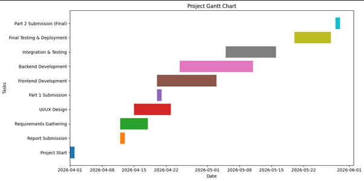
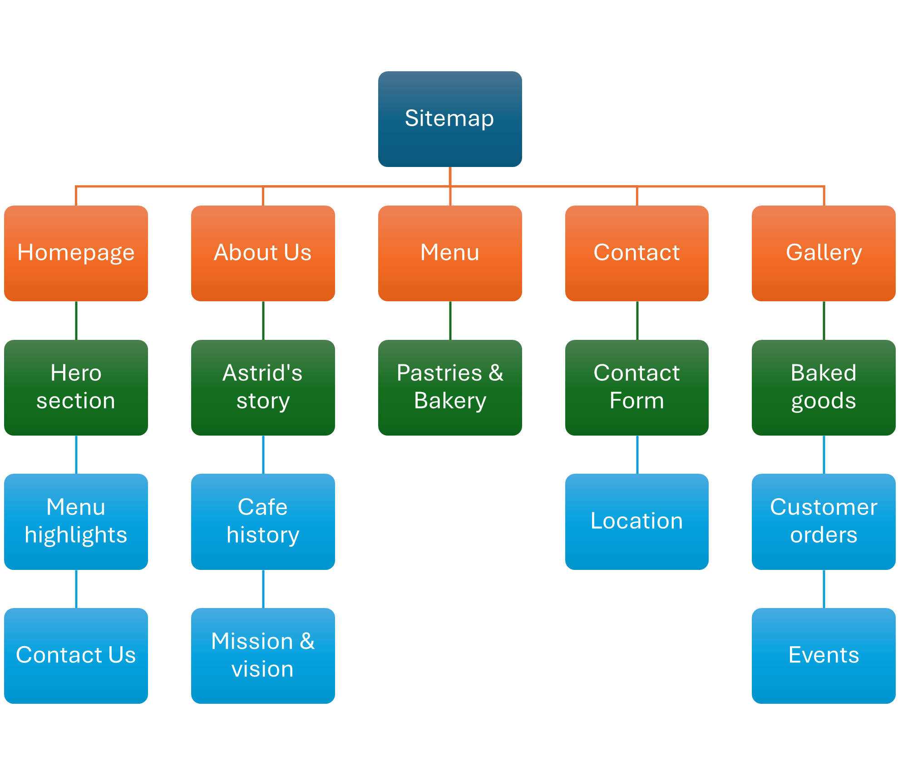
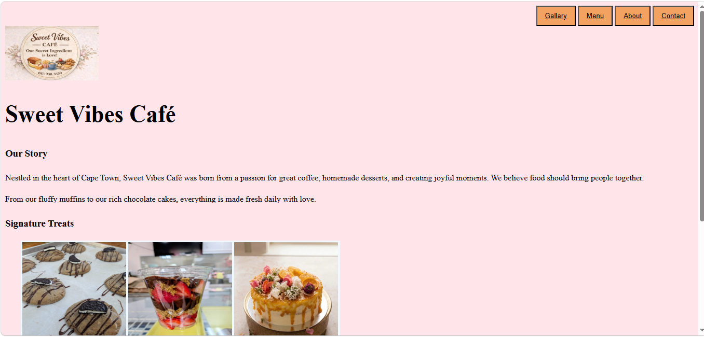
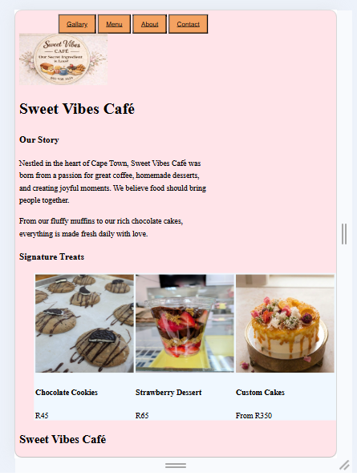

# Project Title

Sweet Vibes Cafe

## Student Information

Name: Standford Neo Nkosi
Student Number: st10103197

## Project Overview

Making a working website for Sweet Vibes Cafe

## Website Goals and Objectives

Main Goals:
•Increase brand visibility and awareness in Kraaifontein and Northern Suburbs
•Generate more customer orders (online and WhatsApp)
•Build a strong community around the brand
•Showcase the menu and make ordering easier
•Attract catering and custom order enquiries

Specific Objectives:
•Achieve 500+ unique visitors per month within the first 6 months
•Generate at least 30 online orders or enquiries per month
•Build an email/WhatsApp subscriber list of 300+ customers
•Reduce time spent on phone calls by displaying menu, prices, and ordering information clearly

## Timeline and Milestones

## Sitemap

## References

Duckett, J. (2021) _HTML and CSS: Design and Build Websites_. Indianapolis: John Wiley & Sons.

Mozilla Developer Network (2025) _HTML: HyperText Markup Language_. Available at: <https://developer.mozilla.org/en-US/docs/Web/HTML> (Accessed: 28 May 2026).

Niederst Robbins, J. (2020) _Learning Web Design: A Beginner's Guide_. 5th edn. Sebastopol: O'Reilly Media.

W3C (2024) _Web Content Accessibility Guidelines (WCAG) 2.2_. Available at: <https://www.w3.org/WAI/standards-guidelines/wcag/> (Accessed: 28 May 2026).

Part 2
CSS styling for desktop solutions
responsive design

## Screenshots

